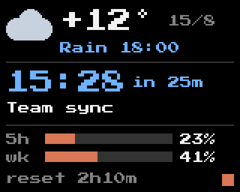
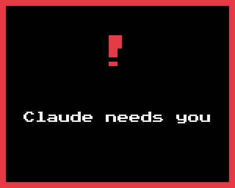

# MiniToo Dashboard

A glanceable desk dashboard for the Divoom MiniToo: **weather**, **today's next
calendar event** and **Claude subscription limits**, with a small Claude Code
status badge. When Claude asks you something, the screen switches
to an alert.

It pairs with [Clauddy](../clauddy/README.md): the dashboard replaces Clauddy's
`working` and `chilling` faces and uses Clauddy's `alerting` face for alerts.

## What it shows

One calm, static screen in three rows. Nothing flips or animates, so the only
thing that grabs your attention is the alert.

| Dashboard | Alert (without Clauddy) |
| :---: | :---: |
|  |  |

- **Weather** (top): current temperature, today's high/low, and when rain or
  snow is expected (otherwise the sky condition), for a city you choose. Data
  from [Open-Meteo](https://open-meteo.com/) (no key, no account).
- **Next event or reminder** (middle), from macOS Calendar and Reminders:
  1. the next timed item today, whether a calendar event or a reminder with a
     time, or the event in progress ("NOW / until 15:00");
  2. otherwise the oldest **overdue** reminder (yellow "OVERDUE"), including a
     timed reminder from today whose time has passed;
  3. otherwise a reminder due **today** without a time ("TODAY").

  Reminders get a checkbox. "+N" on the right counts your other open
  reminders: timed today, overdue and date-only today. Completed reminders,
  all-day events and anything due tomorrow are not shown. With nothing to
  show, the row says "No events left".
- **Claude limits** (bottom, Pro/Max): 5-hour and weekly usage bars, and time
  until the 5-hour window resets.
- **Status badge** (bottom right): orange while Claude is working, grey when it
  is idle. It changes within a second or two.
- **Codex limits** (optional, `CODEX=on`): the bottom row becomes a small table,
  Claude (orange) and Codex (teal) side by side, each with its 5-hour and weekly
  bars, the 5-hour reset time and a status square after the name (coloured while
  that agent is working, grey when idle). See
  [Where Codex limits come from](#where-codex-limits-come-from).
- **Alert**: when Claude asks you something (a permission prompt or a
  question), the screen switches to Clauddy's `alerting` face instantly.
  Without Clauddy, a red alert frame is shown instead.
- **Limit alert**: when a 5-hour or weekly limit (Claude, or Codex with
  `CODEX=on`) reaches 90% used, the screen shows a full-screen frame for 10
  seconds ("Claude / 5-hour limit / 92% / reset 1h20m"), then the dashboard
  returns. Each window is announced once, until it resets, even across restarts;
  several crossings follow one another. A question alert takes priority, and a
  paused dashboard announces after `resume`. Threshold: `LIMIT_ALERT`.

Screen text is English by default; Russian is available.

## Requirements

- macOS, a MiniToo paired in System Settings > Bluetooth
- Python 3 with Pillow (`python3 -m pip install --user Pillow`)
- Xcode Command Line Tools (`xcode-select --install`)
- Recommended: Clauddy installed first (`apps/clauddy/install.sh`) for the
  instant alert face

Close the Divoom phone app while the dashboard runs: the device accepts only
one Bluetooth client at a time.

## Install

```bash
cd apps/minitoo-dashboard
./install.sh
```

The installer asks for the on-screen language and the weather city, then:

1. writes `~/.minitoo-dashboard/config` (the device's Bluetooth MAC is taken
   from Clauddy's config or detected automatically);
2. builds a small calendar helper and asks macOS for Calendar and Reminders
   access;
3. adds hooks to `~/.claude/settings.json` (after making a backup). If Clauddy
   hooks are present, it asks before replacing them;
4. installs a status line command that captures Claude limits. If you already
   have a status line, it prints one line to add to your script instead;
5. installs the `/dashboard-city` command for Claude Code;
6. starts the background daemon with launchd (`local.minitoo.dashboard`).

Start a new Claude Code session afterwards so the hooks load.

## Everyday use

```bash
minitoo-dashboard status           # what the dashboard is doing, data freshness
minitoo-dashboard city "Kazan"     # change the weather city
minitoo-dashboard preview          # render the current screen to PNG
minitoo-dashboard pause            # release the device (e.g. for the phone app)
minitoo-dashboard resume
minitoo-dashboard logs
minitoo-dashboard grant-keychain   # CLAUDE_LIMITS=direct: allow Keychain access (shows the prompt)
minitoo-dashboard refresh-limits   # CLAUDE_LIMITS=direct: check Claude limits now
```

In Claude Code: `/dashboard-city Kazan`. When a name matches several places,
the command lists them and asks which one you mean.

`~/.local/bin` must be on your `PATH` for the short command; otherwise run
`apps/minitoo-dashboard/bin/minitoo-dashboard`.

### Config

`~/.minitoo-dashboard/config` holds `KEY=value` lines. The daemon re-reads it
every second.

| Key | Default | Meaning |
| --- | --- | --- |
| `DEVICE_MAC` | from installer | MiniToo Bluetooth MAC |
| `CITY_NAME`, `CITY_LAT`, `CITY_LON` | from installer | weather location (use `minitoo-dashboard city`) |
| `TEMP_UNIT` | from macOS settings | `celsius` or `fahrenheit` |
| `LANG` | `en` | on-screen language: `en` or `ru` |
| `CALENDARS` | `all` | comma-separated calendar and Reminders list names to include |
| `SEND_DELAY_MS` | `20` | pause between Bluetooth chunks (0–200) |
| `CLAUDE_LIMITS` | `statusline` | `statusline`, or `direct` to also ask Anthropic every 5 min (see below) |
| `CODEX` | `off` | `on` shows Codex (ChatGPT) limits and working status next to Claude's |
| `LIMIT_ALERT` | `90` | % used that shows a limit alert (1–100), or `off` |

## Where Claude limits come from

- **`statusline` (default).** Claude Code passes subscription limits to its
  status line command, which the installer sets up. This is documented and
  needs no credentials, but only the terminal `claude` CLI runs status line
  commands. The Claude desktop app and the VS Code extension do not, so while
  you use those the numbers go stale and show "as of HH:MM".
- **`direct` (opt-in).** Every 5 minutes a small helper, `usage-helper`, reads
  Claude Code's login from the macOS Keychain and asks the same endpoint that
  Claude Code's `/usage` uses. Only percentages and reset times leave the
  helper; the token is never printed, stored or refreshed. The installer (or
  `minitoo-dashboard grant-keychain`) runs it once in the foreground, and macOS
  asks whether `usage-helper` may use the "Claude Code-credentials" item.
  Choose *Always Allow*: the grant covers only this helper. The background
  daemon never shows that prompt: if access is lost, it shows one macOS
  notification, falls back to the status line, retries every 30 minutes and
  `status` tells you to run `grant-keychain`. Be aware that:
  - the endpoint is **undocumented** and may change or disappear at any time;
  - using a subscription token outside Claude Code is a grey area in
    Anthropic's terms;
  - an expired token is skipped, not refreshed. It renews the next time Claude
    Code runs.

  If the endpoint refuses (403 without an active subscription, 429 rate
  limited), the daemon waits 10, 20, 40, then 60 minutes between attempts
  (longer if the server sends `Retry-After`); sleep/wake does not cut the wait
  short. `minitoo-dashboard refresh-limits` checks at once.
  If a direct request fails, the dashboard keeps the last numbers, the status
  line still updates them, and `minitoo-dashboard status` shows the error. To
  switch, run `minitoo-dashboard init --claude-limits direct` (or `statusline`).
  After rebuilding `usage-helper`, run `minitoo-dashboard grant-keychain` again.

## Where Codex limits come from

Every Codex client (the ChatGPT desktop app, the VS Code extension, the CLI)
writes session logs to `~/.codex/sessions`, and those logs include the
subscription's 5-hour and weekly usage. With `CODEX=on` the dashboard reads
what was appended to the logs changed in the last 30 minutes, every 5 seconds.
It needs no credentials and makes no network requests. A custom `CODEX_HOME`
is not supported.

- The numbers refresh only while you use Codex. The time until the 5-hour reset
  is always shown under the column, even when the numbers are old, because the
  logs record the exact reset time ("reset" once it has passed). Usage from
  another device or Codex cloud tasks is not in this Mac's logs, so the
  percentages can lag behind until you use Codex here again.
- **Both columns show how much is used**, from 0% (nothing used) to 100% (limit
  reached), the way Claude reports it. The ChatGPT/Codex apps show the opposite,
  how much is **left**: Codex "78% left" appears here as 22%. The dashboard
  keeps one direction so the two columns can be compared at a glance.
- The square after "Codex" is teal while a Codex turn is running and grey
  otherwise.
- If reading the logs keeps failing (for example the cache folder is not
  writable), the error is logged once and then at most every 10 minutes, and
  `minitoo-dashboard status` shows it as "Codex error".
- Codex has no alert screen; only Claude's questions switch the screen.

Turn it on with `minitoo-dashboard init --codex on` (or `off`); the installer
asks when it finds `~/.codex`.

## How it works

One background process owns the screen; everything else only writes files in
`~/.minitoo-dashboard/`:

```
Claude Code hooks ──► sessions/<session_id>   ┐
Status line script ─► cache/claude.json        │
Weather fetcher ────► cache/weather.json       ├─► daemon ─► core/dv ─► MiniToo
Calendar helper ────► cache/calendar.json      ┘  (launchd)
```

- Each Claude Code session reports its own state. If any session is waiting
  for you, the screen shows the alert. If any is working, the badge is orange.
  A session silent for 30 minutes is ignored.
- The screen is sent as a single-frame live animation (opcode `0x8B`, see
  [FINDINGS.md](../../FINDINGS.md) §8i). An upload takes well under a second,
  and an unchanged screen is re-sent every 5 minutes so a rebooted MiniToo
  gets it back.

| Data | Refresh |
| --- | --- |
| Weather | every 15 min |
| Calendar | every minute |
| Claude limits | whenever Claude Code updates its status line |
| Screen | every minute and on any change; identical frames are not re-sent |

## Troubleshooting

- **The screen does not change.** Run `minitoo-dashboard status`. With the
  device off, out of range or held by the phone, the daemon retries after
  30 s, 1, 2 and 5 minutes, and recovers by itself. `minitoo-dashboard logs`
  shows the details.
- **"Device reply: not responding" in `status`, or a macOS notification that
  MiniToo is not responding.** The Bluetooth link is open but the MiniToo
  ignores it, typically because the Divoom phone app connected to it: closing the
  app does not release it (the phone keeps the link for notifications).
  Turn off Bluetooth on the phone and restart MiniToo. In testing, disconnecting
  MiniToo in the phone's settings was not enough, and after a restart the phone
  reconnects before the Mac does. The dashboard reconnects and returns by itself
  within a few minutes (its retries back off up to 5 minutes).
- **"No events left" although you have something today.** Nothing timed is left today, or Calendar access was not
  granted: System Settings > Privacy & Security > Calendars > `calendar-helper`.
  Reminders need their own permission: System Settings > Privacy & Security >
  Reminders > `calendar-helper` (`minitoo-dashboard status` shows both).
- **Claude row says "no data yet" or shows an old "as of" time.** Limits come
  from Claude Code's status line, which runs in the terminal `claude` CLI. The
  Claude desktop app's Code tab and the VS Code extension do not run status
  line commands, so limits refresh only while you use the terminal CLI, unless you
  enable `CLAUDE_LIMITS=direct`.
- **"Keychain access needed" in `status`.** macOS dropped the helper's
  Keychain grant. It happens after rebuilding `usage-helper` and can happen
  when Claude Code rewrites its login item. Run `minitoo-dashboard grant-keychain`
  and choose *Always Allow*.
- **`http_403` or `http_429` in `status`.** The endpoint refused: usually the
  subscription lapsed (403), and repeated refusals get rate limited (429). After
  renewing, run `minitoo-dashboard refresh-limits`; if it still fails, start
  `claude` in Terminal so Claude Code renews its login, then try again.
- **You already had a status line.** Add
  `printf '%s' "$input" | "<path>/bin/statusline.py"` near the top of your
  script, after it reads stdin into `$input`.

## Uninstall

```bash
./uninstall.sh
```

It stops the daemon, removes the hooks and status line, restores Clauddy's
hooks if they were replaced, and asks before deleting `~/.minitoo-dashboard`.

## Credits

- Font: [Press Start 2P](https://fonts.google.com/specimen/Press+Start+2P) by
  CodeMan38, SIL Open Font License 1.1 (`fonts/OFL.txt`).
- Weather data: [Open-Meteo](https://open-meteo.com/).
